# TechFix

## 🌟 Overview

TechFix is a RESTful web application designed to manage products, inventory, orders, and quotations for both suppliers and the TechFix company itself. It also includes supplier management features. This project was developed for a Service Oriented Computing (SOA) module.

---

## ✨ Key Features

*   Supplier Dashboard: Manage and view key metrics related to their performance.
*   Inventory Management: Track and manage product inventory.
*   Order Management: Create, view, and manage orders.
*   Product Management: Add, update, and manage products.
*   Quotation Management: Generate and manage quotations.
*   Supplier Management (TechFix): Manage supplier information and relationships.

---

## 🛠️ Technology Stack

*   **Frontend:** HTML, CSS, JavaScript
*   **Backend:** Python (Flask)
*   **Database:** MySQL (pymysql)
*   **Deployment:** WAMP (local)

---

## 🚀 Getting Started

### Prerequisites

*   WAMP Server
*   Python 3.x
*   pip

### Installation & Setup

1.  Clone the repository:
    ```bash
    git clone https://github.com/ama-23-ops/TechFix-UniversityProject.git
    ```
2.  Navigate to the project directory:
    ```bash
    cd TechFix-UniversityProject
    ```
3.  Install dependencies:
    ```bash
    pip install -r requirements.txt
    ```
4.  Set up the database: (See config.py and models.py for database configuration)
5.  Create an admin user:
    ```bash
    python create_admin.py
    ```

### Running the Application

*   Run the application: `python app.py`
*   Default URL: `http://localhost:5000`

---

## 💡 Project Structure 


```
project-root/
├── app.py # Main application entry point
├── config.py # Configuration settings
├── create_admin.py # Script to create an admin user
├── models.py # Database models
├── requirements.txt # Python dependencies
├── blueprints/ # Flask blueprints for different parts of the application
│ ├── auth_bp.py # Authentication blueprint
│ ├── supplier/ # Supplier blueprints
│ └── techfix/ # TechFix blueprints
├── client/ # Client-side scripts and notebooks
├── integrations/ # Integrations with external suppliers
├── services/ # Business logic services
├── static/ # Static files (CSS, JavaScript)
├── templates/ # HTML templates
└── tests/ # Unit tests

```
---

## 🎯 Learning & Challenges

This project was a deep dive into backend development, learning Flask, REST API design, and SOA concepts. Managing database migrations and designing a clean API structure were key challenges. Gained proficiency in using Postman for API testing.

---

## 📸 Screenshots

| Feature/Screen   | Screenshot                                                          |
| ---------------- | ------------------------------------------------------------------- |
| Login UI         | 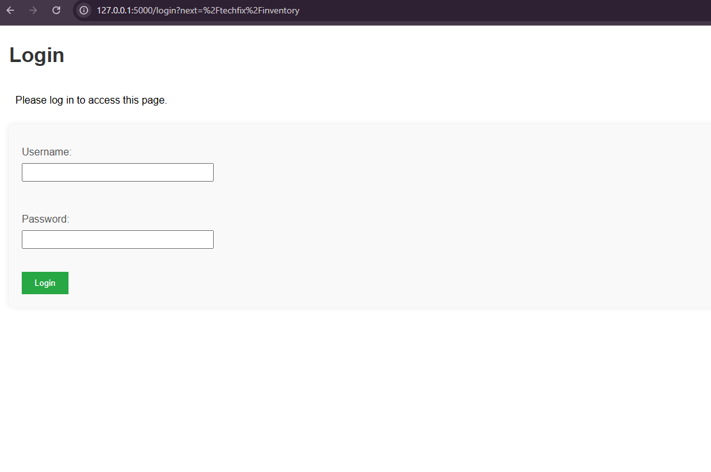                          |
| Inventory UI     | 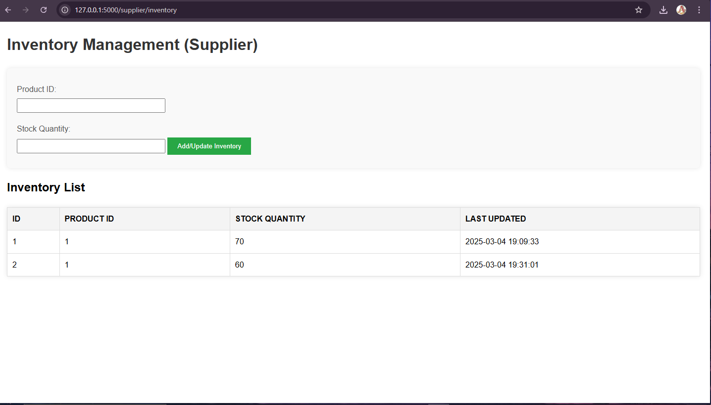                      |
| Inventory UI     | 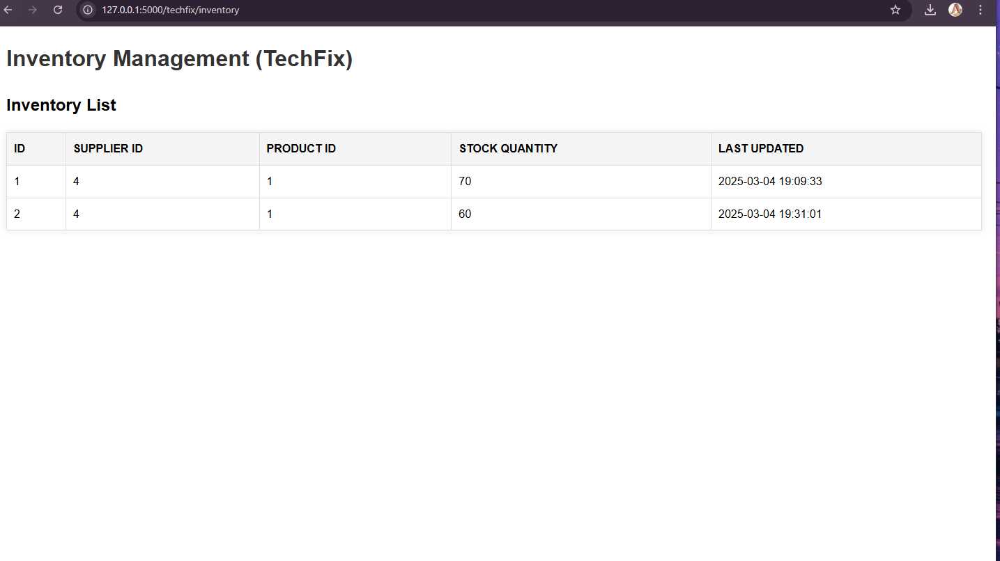                      |
| Product UI 1     | 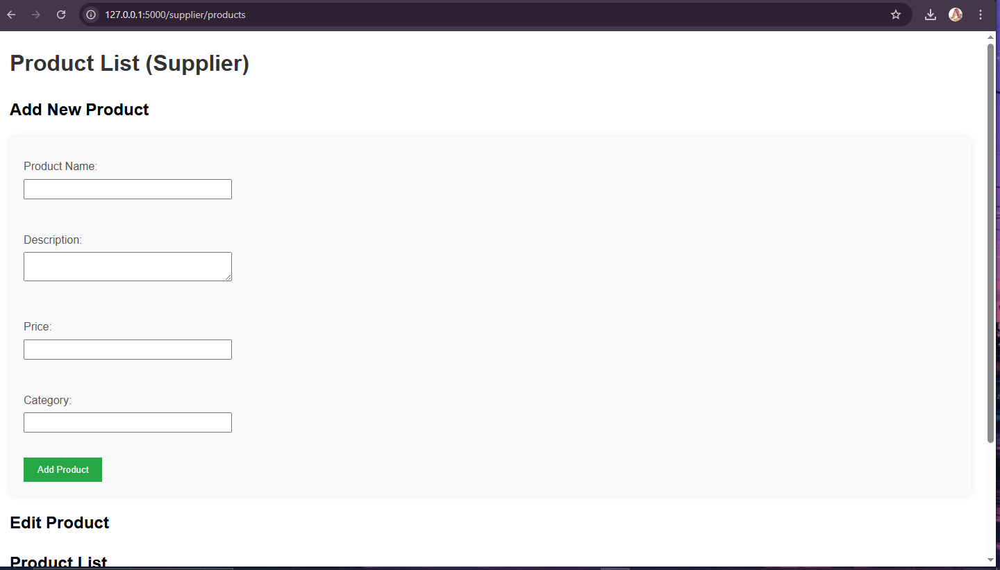                      |
| Product UI 2     | 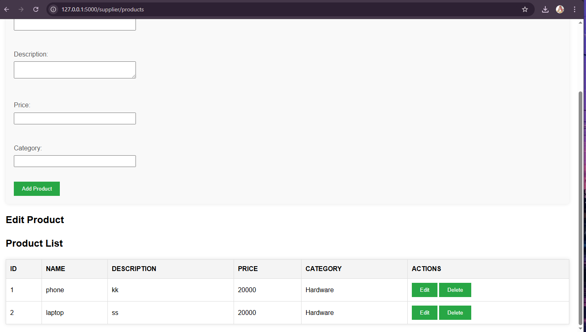                      |
| Product UI 3     | 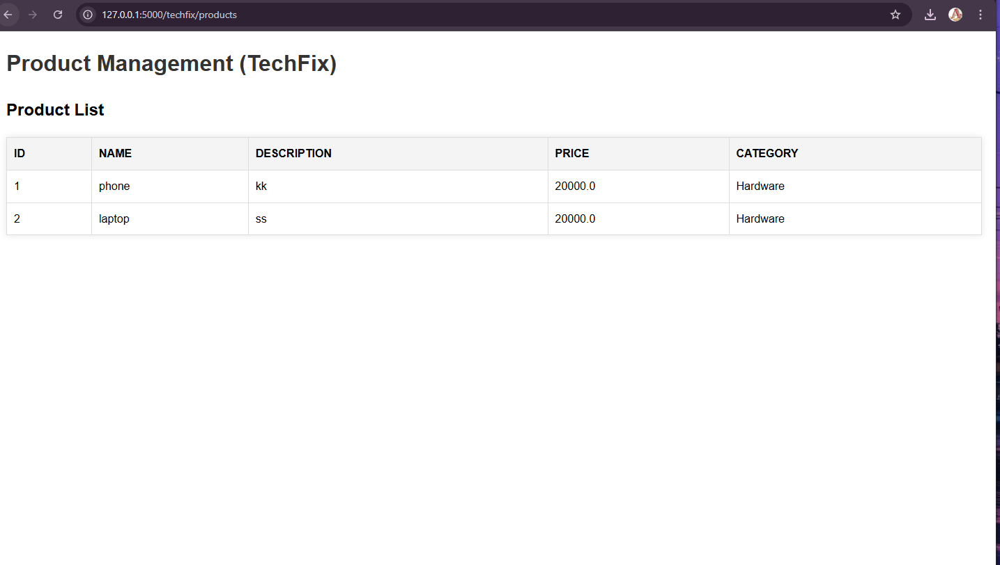                      |
| Dashboard        | 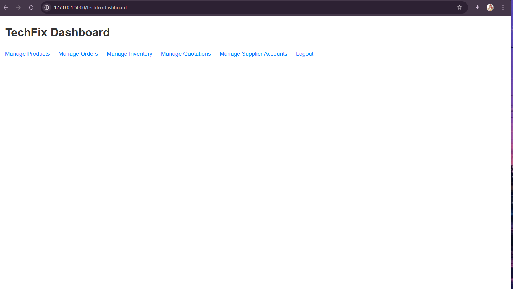                         |
| Supplier List UI | 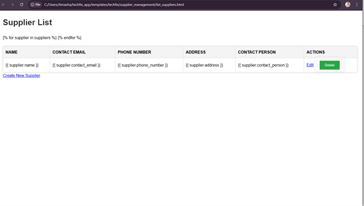                  |
| Edit User UI     | 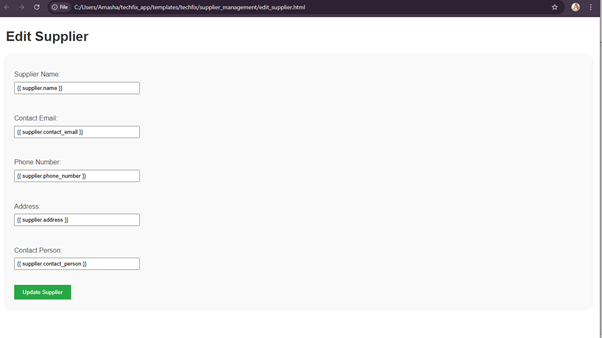                      |
| Add User UI      | 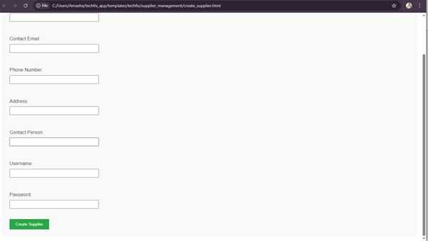                     |
| Quotations UI    | 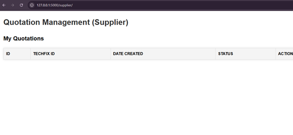                    |

---

## 📜 License

This project is licensed under the MIT License - see the [LICENSE.md](LICENSE.md) file for details.

---
